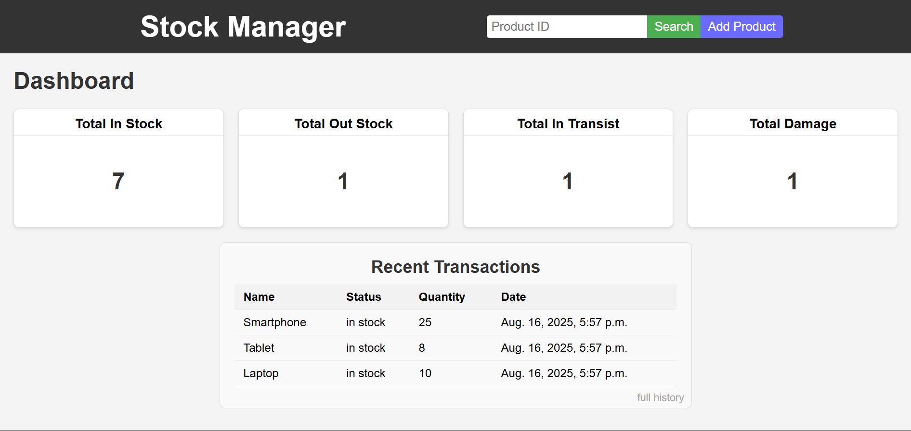
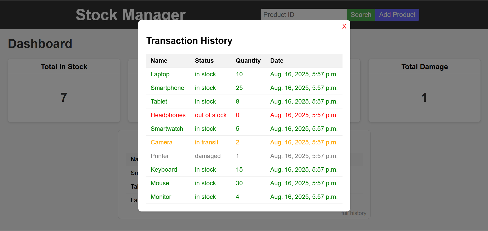

# StockManager


> **Note:** This is my first Django project.  
I created StockManager to learn the Django framework and experiment with fundamental web development concepts, including models, views, templates, authentication, and integration of a relational database.

***

## 🚀 Features

- **Product Catalog:** Add, update, and delete products with details like name, SKU, quantity, and price.  
- **Inventory Tracking:** Maintain accurate stock levels with real-time updates.  
- **Purchase & Sales Management:** Record and monitor stock inflows and outflows.  
- **Search & Filter:** Quickly locate products using search bars and advanced filters.  
- **Data Persistence:** All data is securely stored in an integrated PostgreSQl database.  
- **User-Friendly Interface:** Easily navigate via Django’s default admin UI and responsive single-page interface.  
- **Extensible Design:** Easily add more fields, integrate with APIs, or expand the feature set as you learn more.

***

## 📸 Screenshots


  

## Architecture
StockManager follows conventional Django project structuring:

```
StockManager/
│
├── inventory/         # Contains inventory app logic, models, views, templates
├── stockmanager/      # Django project settings and config files
├── db.sqlite3         # SQLite local database file (generated after migrations)
├── manage.py          # Django’s management script
└── screenshots/       # (Optional) App screenshots and images
```

- **Models:** Define data structures for products, categories, and transactions.  
- **Views:** Handle user interactions, CRUD operations, and route data to templates.  
- **Templates:** Render HTML interfaces for users and admins.  
- **Admin:** Default Django admin for backend management.

***

## 📝 Usage

### Prerequisites

- Python 3.x  
- Django 3.x or above

### Local Setup

1. Clone the repository:  
   ```bash
   git clone https://github.com/SebastianBenjamin/StockManager.git
   cd StockManager
   ```
2. Install Django dependencies:  
   ```bash
   pip install django
   ```
3. Apply database migrations:  
   ```bash
   python manage.py migrate
   ```
4. Create an admin user (optional, for Django admin panel):  
   ```bash
   python manage.py createsuperuser
   ```
5. Start the development server:  
   ```bash
   python manage.py runserver
   ```
6. Access the web app by opening:  
   `http://127.0.0.1:8000/` in your browser.

### Django Admin

Navigate to `/admin` and log in with your superuser account to manage inventory, entries, and transactions.

***

## ⚡ Customization

- **Models:** Add fields or new models by editing `inventory/models.py`.  
- **Templates:** Modify HTML/CSS in `inventory/templates/`.  
- **Views:** Expand logic in `inventory/views.py`.  
- **Static Files:** Add images, JavaScript, or CSS in the appropriate static folder for advanced styling.

***

## 🛠 Tech Stack

- Language: Python  
- Framework: Django  
- Database: PostgreSQL
- Frontend: HTML, CSS templates (Single-page app architecture)  

***

## 🤝 Community & Contributions

I'm learning and welcome feedback!  
- Open issues for bugs, feature requests, or code suggestions.  
- Fork the repository and open pull requests for improvements.  
- Share ideas or discuss possible enhancements.

***

## 📄 License

This project is licensed under the MIT License.

***

## ✨ Acknowledgments

- Django documentation and tutorials for guidance.  
- Open source libraries and the helpful programming community.  

Interested users and contributors are very welcome—the project and its documentation will improve as I deepen my Django expertise!

***

